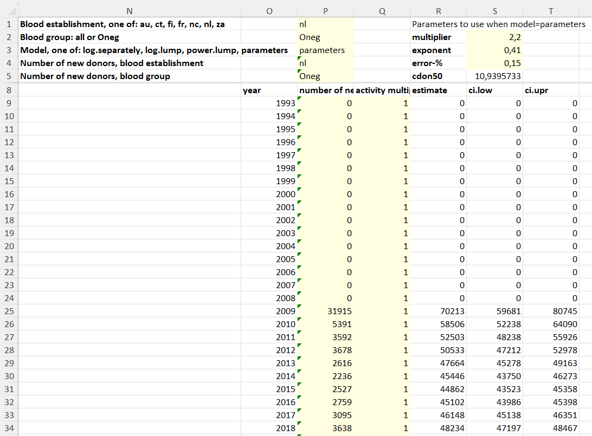

# donor-recruitment-prediction
Code for predicting future donation amounts with from historical donation data.

# Spreadsheet tool
## Participating blood establishments
The followin codes are used for the blood establishment:
- **au**: Australian Red Cross Lifeblood (Australia)
- **ct**: Blood and Tissue Bank (BST, Catalonia, Spain)
- **fi**: Finnish Red Cross Blood establishment (FRCBS, Finland)
- **fr**: Établissement français du sang (France)
- **nc**: Banco de Sangre y Tejidos de Navarra (Navarre, Spain)
- **nl**: Sanquin Blood Supply Foundation (Netherlands)
- **za**: South African National Blood Service (South Africa)
  
## Source data 
### Predicted donation activity
The spreadsheet tool contains the predicted donation activity as a function of time since the year of first donation estimated for: 
- each participating blood establishment
- The blood group, ie., O-negative donors (**Oneg**) and all donors (**all**)
- three different models: **log.separately**, **log.lump**, and **power.lump**, which correspond to the models (d), (a) and (b) in Figure 2 of the manuscript, respectively.
This data is on sheet **main** but hidden by default and it is not recommended to be manipulated directly.
### Number of new donors
The sheet **nr of new donors** contains the number of new donors per blood establishment and year. This sheet is protected by default and it is not recommended to be edited. Formulas on sheet **main** (column *number of new donors*) link to this data based on the selections made in the paremeters section of that sheet.
### Coefficients
This sheet contains the coefficients *multiplier* and *exponent* and their confidence intervals, explained in detail in the manuscript, for each combination of blood group and establishment.
This sheet is protected by default and it is not recommended to be edited.
The coefficients can be used to estimate the relative donation activity (as reflected by *cdon50* values) between blood establishments, eg. to assess what level activity could be reached by altering the management process; the ratio between the maximum achievable activity and current activity can then be entered in the *activity multiplier* column.
### Actual donations
This sheet contains the number of actual donations per year for each blood establishment and blood group.
Please note that sum of actual donations on a year is *not equal to* the number of donations recorded in the raw data for that year. Instead, for each donor, the number of donations during one year since the donor's date of first donation is recorded for the year of first donation, and similarly for other years.

## Functionality
The figure below contains the parameter section of the **main** sheet and initial years of a scenario created based on the parameters.
In short, a prediction of donation activity is combined with a time series of the number of new donors (per year) to come up with forecasts of blood donations in future years.
### Parameters
The parameters on the top part of the **main** worksheet are grouped into two parts, pertaining to the predictive *model* used and the *number of new donors*.
The parameters for the predictive model are
- **Blood establishment**
- **Blood group**
- **Model**, ie. which functional form and split of data is was used to create the estimates.
The possible values for the cells P1 through P3 are given in the spreadsheet, see also figure below.

If the *model* parameter is given the value parameters, the parameters **multiplier (a)**, **exponent (b)** and **error-% (e)** are used to create predections using the formula 
*cdon=a·xb*
  for the estimate and for the confidence interval 
*y=(1&#177;e)·a·x(1&#177;e)·b*,
 where *x* is years since first donation and cdon is the cumulative number of donations. The corresponding *cdon50* value (estimated cumulative number of donations at 50 years since first donation).

The parameters can be used to simulate scenarios where it is assumed that the activity of the donors is changed throughout the history, also including past years. Reasonable values for the parameters can be obtained by analysing the factual values for each blood establishment and blood group given on the **coefficients** worksheet. If different parameters are desired for different time spans, it is possible to create copies of the main sheet with different parameters for each copy, and combine parts of the predictions from each copy to create a single scenario.

For the new donors, the parameters are:
- **New of new donors, blood establishment**: From which blood establishment historical nubmer of new donors be used (from **nr of new donors** sheet)? By default, this is set to the same value as above for predictions (cell P1).
- **Number of new donors, blood group**: For which blood group should the historical data be fetched?

### Forecasts

The forecasts are computed at the bottom part of the **main** sheet. Columns *year*, *estimate*, *ci.low* (the lower bound of a 95% confidence interval of *estimate*) and *ci.hi* (the upper bound of the confidence interval), are computed using the formulas and **should not be edited**. 

On the other hand, the the *number of new donors* column can be edited to contain custom estimates of the number of new donors per year. By default, the last known value is copied down in the table. 

Similarly, the *activity multiplier* can be edited to account for changes in the overall donation activity during the specific year (*year* column). In other words, this is a simple multiplier applied to all the forecasted donations for the year. The multiplier can be used to create scenarios where it is assumed that the overall activity of the donors is changed, irrespective of their year of first donation. As an example, it one could assume that through management, the overall activity of donors is increased by 10% or the activity of O-negative donors decreases to the level of all donors.

## Charts and illustrations
No charts or custom analysis are included by default, but these can freely added using the standard Excel functionality.
